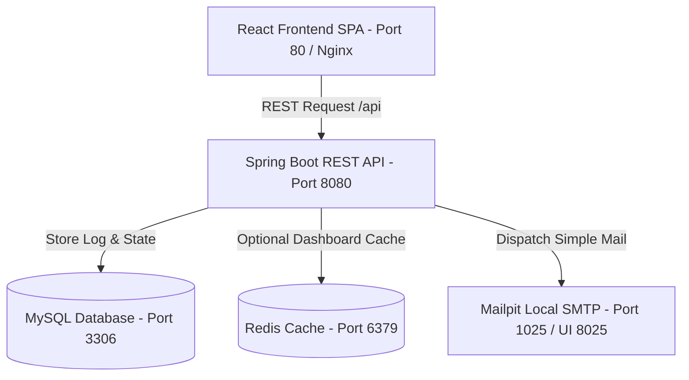

# NotifyHub – Email Automation Platform

NotifyHub is a production-style, clean architecture email automation platform. It allows authenticated users to create dynamic email templates, send immediate emails, schedule future deliveries, and audit dispatch outcomes.

---

## Key Features

1. **Vibrant Real-Time Dashboard**: Features clean HSL tailored palettes, metric aggregation (Total Sent, Total Failed, Scheduled, Active Templates), and dynamic recent activities.
2. **Automatic Template Variable Discovery**: Discovers custom double curly-brace parameters (e.g. `{{name}}`, `{{invoiceId}}`) inside templates dynamically and renders responsive input fields on the fly.
3. **Unified Audit Hub**: Lists historical logs (SENT/FAILED) and active scheduled cron queue deliveries. Click any email to slide out a complete audit modal with error logs and content preview.
4. **Developer Sandbox Mail Server**: Includes **Mailpit** inside Docker Compose to cleanly capture all outgoing SMTP deliveries locally without requiring a real SMTP server. View mock deliveries in a web inbox interface on port `8025`.
5. **High-Performance Caching**: Seamlessly caches critical dashboard metrics in **Redis**, featuring automated eviction upon new logging activities or template updates, falling back gracefully to direct MySQL queries if Redis is offline.

---

## Architecture & Tech Stack



- **Backend**: Java 21, Spring Boot 3.3.0, Spring Security (Stateless JWT Filter), Spring Data JPA, Spring Validation, JavaMailSender, Lombok.
- **Frontend**: React 18, Vite, Tailwind CSS, Axios, Lucide React Icons.
- **Database & Cache**: MySQL 8.0, Redis 7.2 (Alpine).
- **Mock SMTP Server**: Mailpit (local sandbox).
- **Orchestration**: Docker Compose.

---

## Default Seed Credentials & Sample Data

Upon initialization, the database is pre-seeded with two accounts and sample templates.

### Active Test Profiles (Password: `password123`)

*   **Operator User**: `operator@notifyhub.com`
*   **Administrator**: `admin@notifyhub.com`

### Seeded Sample Templates

1.  **Invoice Ready Notification**: Includes fields: `{{name}}`, `{{invoiceId}}`, `{{amount}}`
2.  **Welcome Onboarding**: Includes fields: `{{name}}`

---

## Active Host Ports Reference

| Service Name | Port Mapping | URL Link |
| :--- | :--- | :--- |
| **Frontend Console** | `80:80` | [http://localhost](http://localhost) |
| **Backend REST API** | `8080:8080` | [http://localhost:8080](http://localhost:8080) |
| **Mailpit Web Interface** | `8025:8025` | [http://localhost:8025](http://localhost:8025) |
| **MySQL Relational DB** | `3306:3306` | `jdbc:mysql://localhost:3306/notifyhub` |
| **Redis Cache Box** | `6379:6379` | `redis://localhost:6379` |

---

## Running Instructions (Docker Compose)

Ensure you have **Docker** and **Docker Compose** installed on your system.

### 1. Build and Spin Up Environment
Navigate to the project root directory containing `docker-compose.yml` and run:

```bash
docker compose up --build
```

This will automatically:
1. Initialize the MySQL database and run the `schema.sql` to build tables and insert seed data.
2. Spin up Redis and Mailpit.
3. Build the Spring Boot API jar and boot it on port `8080`.
4. Build the React production assets and serve them via Nginx on port `80` with a reverse-proxy forwarding `/api` to the backend.

### 2. Verify Execution
- Open **[http://localhost](http://localhost)** in your browser.
- Log in with email `operator@notifyhub.com` and password `password123`.
- Go to the **Templates** tab to view pre-seeded templates or make a new one.
- Go to **Send Email** to write to a dummy recipient (e.g. `customer@company.com`) and fill variables.
- Verify delivery in **[http://localhost:8025](http://localhost:8025)** (Mailpit Console).
- Schedule an email for +1 minute, and observe the cron job executing every minute to dispatch the scheduled email!
- Review statistics and historical outcomes in **Dashboard** and **Email History**.

---

## Manual Execution (Without Docker)

If you prefer to run services locally without Docker:

### Prerequisites
- Java 21 Installed
- Node.js v18+ Installed
- Local instances of MySQL 8.0 & Redis 6+ running (or disable Redis in yml)
- An active SMTP Server (or local developer SMTP tool)

### 1. Backend REST API
Navigate to `/backend`:
1. Update database credentials in `src/main/resources/application.yml`.
2. Run Spring Boot application:
   ```bash
   mvn spring-boot:run
   ```

### 2. Frontend Console
Navigate to `/frontend`:
1. Install node dependencies:
   ```bash
   npm install
   ```
2. Start Vite local development server:
   ```bash
   npm run dev
   ```
3. Open **[http://localhost:5173](http://localhost:5173)** in your web browser.
